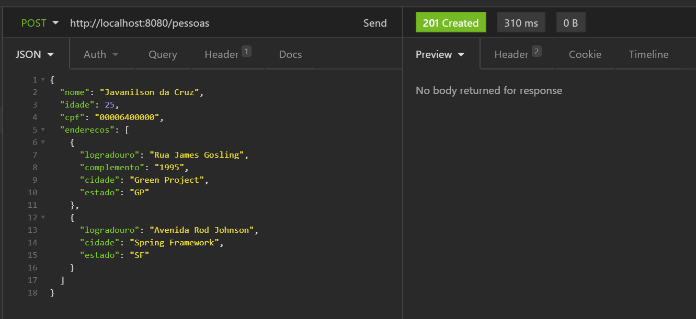
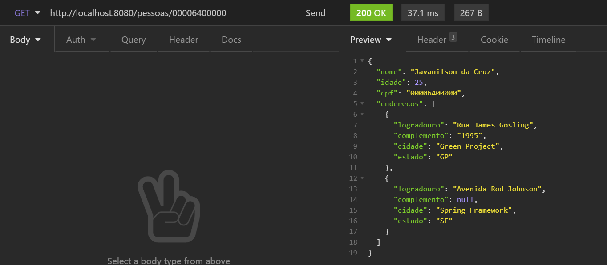

    

    
    
    
    

# 📝 Objetivo

Back-end de um desafio proposto pela [Meta](https://www.meta.com.br/), para atuação no cliente Porto Seguro, a qual deve atender aos seguintes requisitos:

# 💻 Definição do projeto
- [x] Crie uma API utilizando Spring Boot, onde será possível criar e buscar informações de uma pessoa com base no seu CPF.
  Para isso, você precisará criar 2 endpoints REST:
    - [x] Post -> Criação da pessoa
    - [x] Get -> Busca da pessoa com base no CPF

- A entidade Pessoa deve conter os seguintes atributos:
  - Nome (obrigatório, máximo de 30 caracteres)
  - Idade (obrigatório e deve ser maior do que 0)
  - CPF (obrigatório e deve ser válido)
  - Endereço (com no mínimo 1 e no máximo N)

- A entidade Endereço deverá conter os seguintes atributos:
  - Logradouro (obrigatório, máximo de 40 caracteres)
  - Complemento (opcional, máximo de 50 caracteres)
  - Cidade (obrigatório, máximo de 45 caracteres)
  - Estado (obrigatório, máximo de 2 caracteres)

- O cadastro não precisa utilizar uma base de dados, pode utilizar a base de dados em memória.

  
  

  

    
  Feito com 🧡 por <a href="https://samuel-cruz.github.io/" target="_blank">Samuel Cruz</a>

